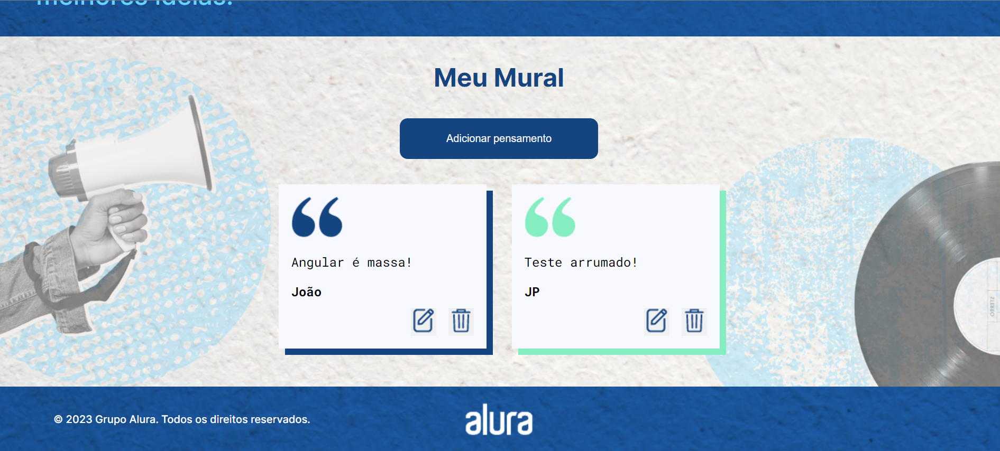

<h1 align="center">
  Memoteca 📝
</h1>

<p align="center">
  <a href="#-sobre-o-projeto">Projeto</a>&nbsp;&nbsp;&nbsp;|&nbsp;&nbsp;&nbsp;
  <a href="#-conceitos-utilizados-no-desenvolvimento">Conceitos</a>&nbsp;&nbsp;&nbsp;|&nbsp;&nbsp;&nbsp;
  <a href="#-tecnologias-utilizadas">Tecnologias</a>&nbsp;&nbsp;&nbsp;|&nbsp;&nbsp;&nbsp;
  <a href="#-como-executar-o-projeto">Executar o projeto</a>&nbsp;&nbsp;&nbsp;|&nbsp;&nbsp;&nbsp;
  <a href="#-licença">Licença</a>
</p>

# 🚧 Sobre o projeto

Preview: https://portifolio-joaosam.vercel.app/

Meu primeiro projeto com Angular. Aqui tive a oportunidade de ter o contato com esse framework tão utilizado no mercado. A ideia desse projeto é ter um lugar onde você possa guardar aqueles recados, mensagens, legendas de fotos e recuperá-los quando quiser.

## 🛠️ Funcionalidades

- Cria, deleta e edita cards
- Salva as informações dos cards em uma APi (Json Server)
- Navega entre páginas
- Responsivo

# 📚 Conceitos Utilizados no Desenvolvimento

- Utilizado a ferramenta Angular CLI para criar um projeto e diversos tipos de arquivos
- Compreendido a estrutura de um componente em Angular
- Utilização do property binding, interpolação, event binding e two-way data binding
- Trabalhamos com algumas das principais diretivas do Angular
- Navegação dinâmica entre componentes através das rotas
- Injeção de dependências na aplicação
- Requisições HTTP através da classe HttpClient e desenvolva um CRUD

## 🎨 Layout



# 🚀 Tecnologias utilizadas

- TypeScript
- Angular
- CSS

# 💻 Como executar o projeto

```bash
# Clonar repositório
git clone https://github.com/Joaosam/Memoteca.git

# Navegar até a pasta
cd Memoteca

# Executar o projeto
ng serve --open
```

## 📝 Licença

Esse projeto está sob a licença MIT. Veja o arquivo [LICENSE](LICENSE) para mais detalhes.
[](hhttps://github.com/Joaosam/Portifolio/blob/main/LICENSE)

<br />

---

Feito com ♥ by Joaosam
